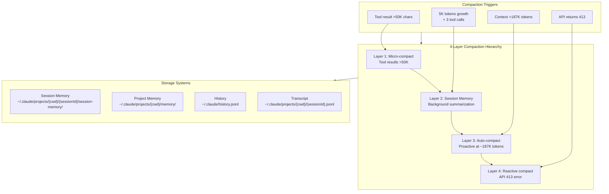
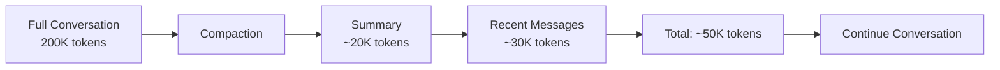
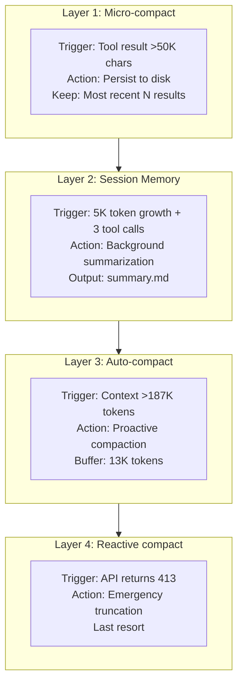
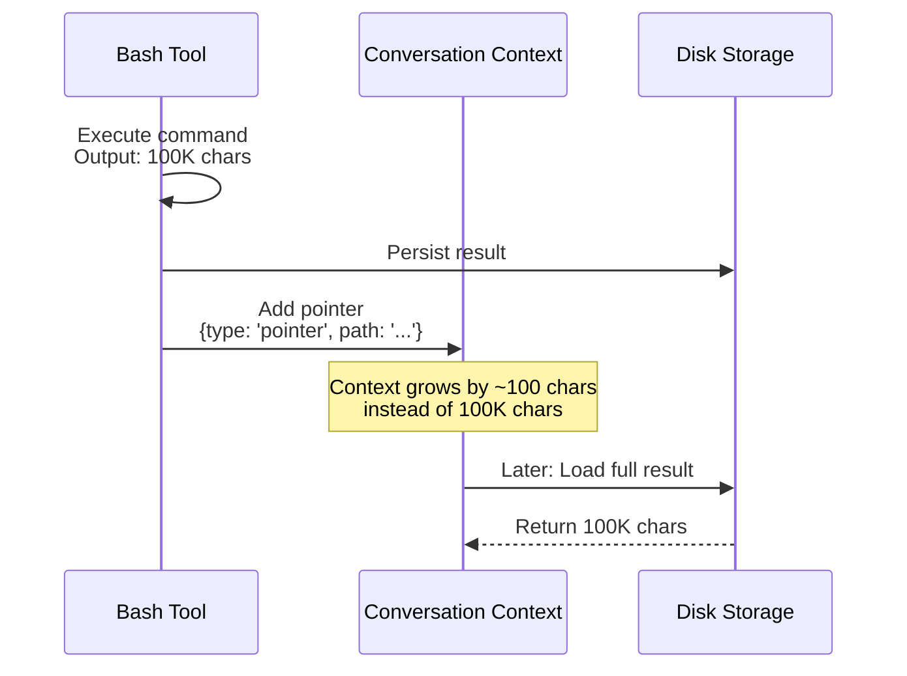
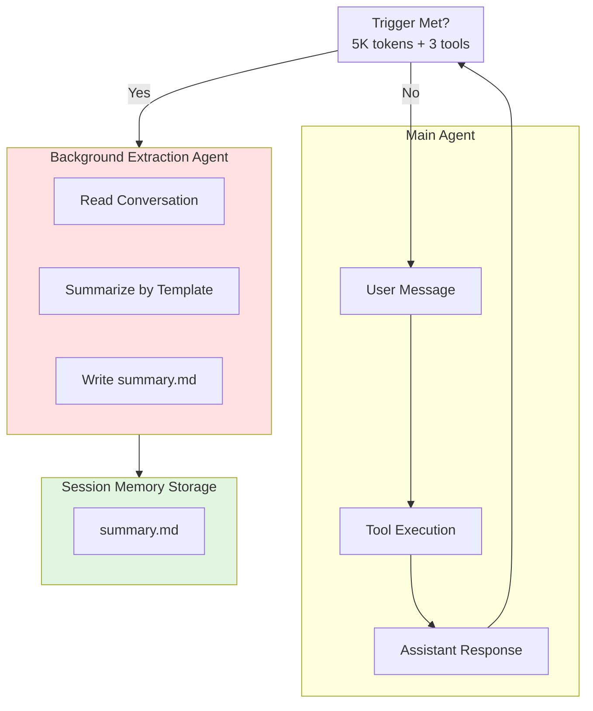
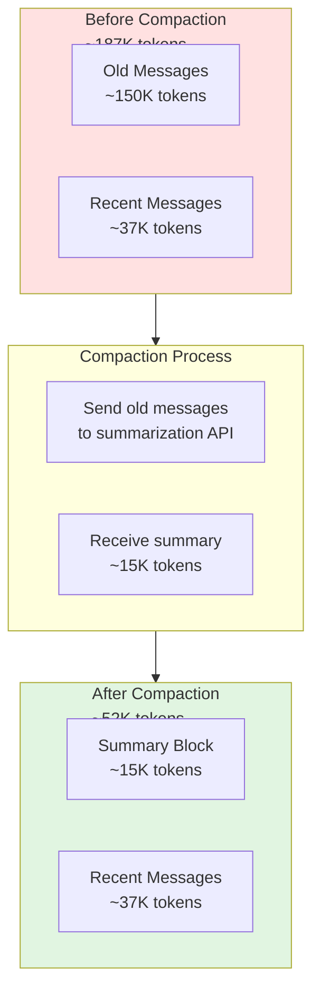
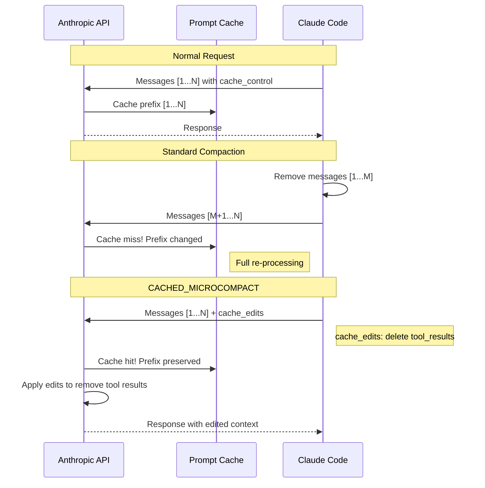

# Claude Code Session Memory and Context Management

## TL;DR

**What this document covers:** The complete internal architecture of how Claude Code manages conversation context, prevents token limit overflows, and preserves important information across sessions. This includes undocumented compaction strategies, hidden memory systems, and obscure cache-preservation mechanisms.

**Key undocumented patterns:**
- **4-layer compaction hierarchy**: Micro-compact → Session Memory → Auto-compact → Reactive compact
- **CACHED_MICROCOMPACT** (ant-only): Uses `cache_edits` API to remove tool results without invalidating prompt cache (saves ~90% on cache misses)
- **13,000 token buffer**: Auto-compact triggers at `context_window - 13K` tokens (not at the limit)
- **Session memory extraction**: Background agent summarizes conversation every 5,000 tokens
- **Team memory path traversal protection**: Double-pass validation with symlink resolution
- **Mutual exclusion**: Main agent and memory extraction agent cannot run simultaneously

**Why this matters:** Understanding these internals helps you:
- Predict when compaction will trigger
- Avoid expensive cache invalidations
- Structure long-running sessions efficiently
- Debug "missing context" issues



---

## Table of Contents

1. [Architecture Overview](#architecture-overview)
2. [The 4-Layer Compaction System](#the-4-layer-compaction-system)
3. [Session Memory System (memdir)](#session-memory-system-memdir)
4. [Background Session Memory Extraction](#background-session-memory-extraction)
5. [Auto-Compaction (Proactive)](#auto-compaction-proactive)
6. [Reactive Compaction](#reactive-compaction)
7. [CACHED_MICROCOMPACT (ant-only)](#cached_microcompact-ant-only)
8. [Storage Systems](#storage-systems)
9. [Security: Path Traversal Protection](#security-path-traversal-protection)
10. [Undocumented Configuration](#undocumented-configuration)

---

## Architecture Overview

Claude Code's context management is designed to handle **infinite-length conversations** within finite API token limits. Unlike simple "clear context" approaches, it uses a **hierarchical compaction system** that preserves important information while discarding expendable content.

### The Core Problem

The Anthropic API has context limits (200K tokens for most models). A long conversation will eventually hit this limit. Claude Code solves this through **progressive summarization**:



**Key insight:** Compaction doesn't just truncate—it **summarizes**, preserving:
- User intent and goals
- Key technical decisions
- File modifications and code snippets
- Errors encountered and solutions
- Pending tasks

### The 4-Layer Defense

Claude Code implements **four layers** of compaction, each triggered at different thresholds:



---

## The 4-Layer Compaction System

### Layer 1: Micro-compact (Tool Result Management)

**File:** `src/services/compact/microCompact.ts`

**Purpose:** Handle individual tool results that are too large for the context window.

**Trigger conditions:**
- Single tool result >50,000 characters (default)
- Aggregate parallel tool results >200,000 characters per message

**Mechanism:**

```typescript
// From src/utils/toolResultStorage.ts
export const DEFAULT_MAX_TOOL_RESULT_CHARS = 50_000
export const MAX_AGGREGATE_TOOL_RESULTS_CHARS_PER_MESSAGE = 200_000

// Large results are persisted to disk
async function persistToolResult(result: ToolResult): Promise<string> {
  const path = getToolResultPath(result.toolUseId)
  await writeFile(path, JSON.stringify(result))
  return path
}
```

**Storage location:** `~/.claude/{project}/{sessionId}/tool-results/{toolUseId}.json`

**Undocumented behavior:**
- Tool results are **replaced with a pointer** in the context: `{type: 'pointer', path: '...'}`
- The full result is loaded **on-demand** when referenced
- This happens transparently—users don't see the difference



### Layer 2: Session Memory (Background Extraction)

**Files:**
- `src/services/SessionMemory/sessionMemory.ts` (orchestration)
- `src/services/SessionMemory/sessionMemoryUtils.ts` (state management)
- `src/services/SessionMemory/prompts.ts` (templates)

**Purpose:** Continuously extract and summarize session context in the background.

**Extraction triggers** (`sessionMemory.ts:134-181`):

```typescript
export function shouldExtractMemory(messages: Message[]): boolean {
  const hasMetTokenThreshold = hasMetUpdateThreshold(currentTokenCount)
  // Default: 5,000 tokens growth since last extraction
  
  const hasMetToolCallThreshold = toolCallsSinceLastUpdate >= getToolCallsBetweenUpdates()
  // Default: 3 tool calls
  
  const hasToolCallsInLastTurn = hasToolCallsInLastAssistantTurn(messages)
  
  // Extract when:
  // 1. Token threshold AND tool call threshold met
  // 2. Token threshold met AND no tool calls in last turn (natural break)
  return (hasMetTokenThreshold && hasMetToolCallThreshold) ||
         (hasMetTokenThreshold && !hasToolCallsInLastTurn)
}
```

**Template structure** (`prompts.ts:11-41`):

The session memory template has 10 sections:

1. **Session Title** - Auto-generated summary
2. **Current State** - What we're currently doing
3. **Task Specification** - Original goal and success criteria
4. **Files and Functions** - Key code elements
5. **Workflow** - Process being followed
6. **Errors & Corrections** - Mistakes and fixes
7. **Codebase Documentation** - Learned patterns
8. **Learnings** - General insights
9. **Key Results** - Outcomes and decisions
10. **Worklog** - Chronological progress

**Storage:** `~/.claude/projects/{cwd}/{sessionId}/session-memory/summary.md`

**Undocumented behavior:**
- Session memory extraction runs in a **forked agent** with restricted permissions
- The main agent and extraction agent have **mutual exclusion**—they can't both write memories
- Extraction uses **Haiku** (cheaper model) for summarization



### Layer 3: Auto-compact (Proactive)

**File:** `src/services/compact/autoCompact.ts`

**Purpose:** Prevent API errors by compacting **before** hitting the limit.

**Threshold calculation** (`autoCompact.ts:62-91`):

```typescript
export const AUTOCOMPACT_BUFFER_TOKENS = 13_000
export const WARNING_THRESHOLD_BUFFER_TOKENS = 20_000
export const ERROR_THRESHOLD_BUFFER_TOKENS = 20_000

export function getAutoCompactThreshold(model: string): number {
  const effectiveContextWindow = getEffectiveContextWindowSize(model)
  // For 200K context: 200,000 - 13,000 = 187,000 tokens
  return effectiveContextWindow - AUTOCOMPACT_BUFFER_TOKENS
}
```

**Why 13,000 tokens buffer?**
- Compaction itself requires API calls (to generate summary)
- Those API calls need headroom
- 13K tokens ≈ 6.5% buffer for 200K context

**Compaction process** (`compact.ts:387-763`):

1. **Identify messages to compact** - Everything except recent N messages
2. **Generate summary** - Using a separate API call with summarization prompt
3. **Replace messages** - Old messages → summary block
4. **Preserve recent context** - Last N messages kept verbatim



**Undocumented feature:** Session Memory Compaction

When session memory is enabled, auto-compact uses the **pre-extracted summary** instead of generating a new one:

```typescript
// src/services/compact/sessionMemoryCompact.ts
export async function trySessionMemoryCompaction(
  messages: Message[],
  agentId?: AgentId,
  autoCompactThreshold?: number,
): Promise<CompactionResult | null> {
  // Returns null if session memory compaction cannot be used
  if (!shouldUseSessionMemoryCompaction()) return null
  
  // Calculate messages to keep based on lastSummarizedMessageId
  const startIndex = calculateMessagesToKeepIndex(messages, lastSummarizedIndex)
  const messagesToKeep = messages.slice(startIndex)
  
  // Create compaction result from session memory content
  return createCompactionResultFromSessionMemory(...)
}
```

This is **faster and cheaper** than on-demand summarization.

### Layer 4: Reactive Compaction (Emergency)

**File:** `src/services/compact/autoCompact.ts:191-199`

**Purpose:** Handle API 413 errors ("Content Too Large") when proactive compaction fails or is disabled.

**REACTIVE_COMPACT feature flag:**

```typescript
if (feature('REACTIVE_COMPACT')) {
  if (getFeatureValue_CACHED_MAY_BE_STALE('tengu_cobalt_raccoon', false)) {
    return false  // Suppress proactive autocompact
    // Let reactive compact handle 413s
  }
}
```

**Mechanism:**
1. API returns 413 error
2. Claude Code catches the error
3. **Progressive truncation** from the tail until request fits
4. Retry with truncated context

**Why this exists:** Sometimes context grows faster than auto-compact can detect (e.g., massive tool output). Reactive compact is the safety net.

---

## CACHED_MICROCOMPACT (ant-only)

**File:** `src/services/compact/microCompact.ts:52-128`

**The most sophisticated undocumented feature.**

### The Problem

Standard compaction invalidates the **prompt cache**. After compaction:
- Cache miss on the entire context
- 10x cost increase ($0.60 → $6.00 for 200K tokens)
- Slower response times

### The Solution

CACHED_MICROCOMPACT uses the `cache_edits` API to **remove tool results without invalidating the cached prefix**:

```typescript
async function cachedMicrocompactPath(messages: Message[]): Promise<MicrocompactResult> {
  const toolsToDelete = mod.getToolResultsToDelete(state)
  
  if (toolsToDelete.length > 0) {
    // Create cache_edits block for API
    const cacheEdits = mod.createCacheEditsBlock(state, toolsToDelete)
    pendingCacheEdits = cacheEdits  // Queued for API layer
    
    return {
      messages,  // Messages unchanged locally
      compactionInfo: { 
        pendingCacheEdits: { 
          trigger: 'auto', 
          deletedToolIds: toolsToDelete,
          baselineCacheDeletedTokens 
        } 
      }
    }
  }
}
```

### How It Works



**Benefits:**
- Cache preserved = 90% cost savings
- Faster responses (no re-processing)
- Transparent to users

**Limitations:**
- ant-only feature flag
- Only removes tool results (not other content)
- Requires API support for `cache_edits`

---

## Session Memory System (memdir)

### Memory Type Taxonomy

**File:** `src/memdir/memoryTypes.ts:14-21`

Claude Code defines **four memory types** with different scopes:

```typescript
export const MEMORY_TYPES = ['user', 'feedback', 'project', 'reference'] as const
```

| Type | Scope | Purpose | Example |
|------|-------|---------|---------|
| `user` | Private | User's role, goals, knowledge | "I'm a senior backend engineer" |
| `feedback` | Private/Team | Guidance on approach corrections | "Don't use regex for HTML parsing" |
| `project` | Team preferred | Ongoing work, deadlines, decisions | "Migrating to TypeScript by Q3" |
| `reference` | Team scope | Pointers to external systems | "API docs at https://..." |

**Why four types?** Different information has different lifetimes and sharing needs. User preferences are private; project deadlines are team-shared.

### Storage Location Resolution

**File:** `src/memdir/paths.ts:223-235`

```typescript
export const getAutoMemPath = memoize(
  (): string => {
    const override = getAutoMemPathOverride() ?? getAutoMemPathSetting()
    if (override) { return override }
    
    const projectsDir = join(getMemoryBaseDir(), 'projects')
    return (
      join(projectsDir, sanitizePath(getAutoMemBase()), AUTO_MEM_DIRNAME) + sep
    ).normalize('NFC')
  },
  () => getProjectRoot(),
)
```

**Default path:** `~/.claude/projects/{sanitized-cwd}/memory/`

**Sanitization rules:**
- Remove leading/trailing slashes
- Replace path separators with `_`
- Normalize Unicode (NFC)
- Truncate to 100 chars

Example: `/home/user/my-project` → `home_user_my-project`

---

## Security: Path Traversal Protection

**File:** `src/memdir/teamMemPaths.ts:228-284`

Team memory has **double-pass validation** to prevent path traversal attacks:

```typescript
export async function validateTeamMemWritePath(filePath: string): Promise<string> {
  // First pass: normalize .. segments
  const resolvedPath = resolve(filePath)
  if (!resolvedPath.startsWith(teamDir)) {
    throw new PathTraversalError(`Path escapes team memory directory`)
  }
  
  // Second pass: resolve symlinks on deepest existing ancestor
  const realPath = await realpathDeepestExisting(resolvedPath)
  if (!(await isRealPathWithinTeamDir(realPath))) {
    throw new PathTraversalError(`Path escapes via symlink`)
  }
  
  return resolvedPath
}
```

**Why two passes?**
1. **First pass:** Catches `../../../etc/passwd` style attacks
2. **Second pass:** Catches symlink attacks (`memory/link -> /etc`)

**Undocumented function:** `realpathDeepestExisting`

Unlike `fs.realpath()` which requires the full path to exist, this resolves symlinks on the deepest existing ancestor:

```typescript
// Path: /team/memory/foo/bar/baz.md
// If /team/memory/foo exists and is a symlink:
// realpathDeepestExisting resolves the symlink
```

---

## Storage Systems

### 1. Session Memory (`session-memory/summary.md`)

**Path:** `~/.claude/projects/{cwd}/{sessionId}/session-memory/summary.md`

**Purpose:** Per-session summarization for compaction

**Format:** Markdown with 10-section template

### 2. Project Memory (`memory/`)

**Path:** `~/.claude/projects/{cwd}/memory/`

**Purpose:** Cross-session durable memory

**Types:**
- `user/` - Private user preferences
- `feedback/` - Approach corrections
- `project/` - Team-shared project state
- `reference/` - External system pointers

### 3. History (`history.jsonl`)

**Path:** `~/.claude/history.jsonl`

**Purpose:** Command history for `/resume` and up-arrow

**Structure:**

```typescript
type LogEntry = {
  display: string           // User-facing display text
  pastedContents: Record<number, StoredPastedContent>
  timestamp: number
  project: string          // Project root path
  sessionId?: string       // For current session filtering
}

const MAX_HISTORY_ITEMS = 100
```

**Undocumented:** Large pasted content (>1024 chars) is stored separately by hash:

```typescript
type StoredPastedContent = {
  id: number
  type: 'text' | 'image'
  content?: string         // Inline for small content
  contentHash?: string     // External paste store reference
}
```

### 4. Transcript (`{sessionId}.jsonl`)

**Path:** `~/.claude/projects/{cwd}/{sessionId}.jsonl`

**Purpose:** Complete conversation record

**Entry types:**

| Type | Purpose |
|------|---------|
| `user`, `assistant`, `attachment`, `system` | Message types |
| `summary` | Compact summaries |
| `custom-title`, `ai-title`, `tag` | Metadata |
| `file-history-snapshot` | File checkpoints for `/rewind` |
| `content-replacement` | Snip operation records |
| `marble-origami-commit`/`snapshot` | Context collapse records |

**File checkpoints** (`sessionStorage.ts:1085-1099`):

Before any file edit, a snapshot is saved:

```typescript
async insertFileHistorySnapshot(
  messageId: UUID,
  snapshot: FileHistorySnapshot,
  isSnapshotUpdate: boolean,
) {
  const fileHistoryMessage: FileHistorySnapshotMessage = {
    type: 'file-history-snapshot',
    messageId,
    snapshot,  // Contains file content at point in time
    isSnapshotUpdate,
  }
  await this.appendEntry(fileHistoryMessage)
}
```

This enables `/rewind` to restore previous file states.

---

## Undocumented Configuration

### Environment Variables

| Variable | Default | Purpose |
|----------|---------|---------|
| `CLAUDE_CODE_AUTO_COMPACT_WINDOW` | 200000 | Custom context window size |
| `CLAUDE_AUTOCOMPACT_PCT_OVERRIDE` | - | Compaction threshold percentage |
| `DISABLE_COMPACT` | false | Disable all compaction |
| `DISABLE_AUTO_COMPACT` | false | Disable only auto-compact |
| `CLAUDE_CODE_BLOCKING_LIMIT_OVERRIDE` | - | Hard token limit |
| `CLAUDE_CONTEXT_COLLAPSE` | - | Enable context collapse (ant-only) |

### Feature Flags

| Flag | Purpose |
|------|---------|
| `CACHED_MICROCOMPACT` | Cache-preserving compaction (ant-only) |
| `REACTIVE_COMPACT` | 413-triggered compaction (ant-only) |
| `CONTEXT_COLLAPSE` | Alternative compaction strategy (ant-only) |
| `SESSION_MEMORY` | Background extraction |

### Compaction Thresholds

```typescript
// From autoCompact.ts
AUTOCOMPACT_BUFFER_TOKENS = 13_000        // Proactive trigger
WARNING_THRESHOLD_BUFFER_TOKENS = 20_000  // Warning threshold
ERROR_THRESHOLD_BUFFER_TOKENS = 20_000    // Error threshold
MANUAL_COMPACT_BUFFER_TOKENS = 3_000      // Manual compact headroom

// From sessionMemoryCompact.ts
DEFAULT_SM_COMPACT_CONFIG = {
  minTokens: 10_000,
  minTextBlockMessages: 5,
  maxTokens: 40_000,
}

// From sessionMemory.ts
minimumMessageTokensToInit = 10_000      // First extraction
minimumTokensBetweenUpdate = 5_000       // Subsequent extractions
toolCallsBetweenUpdates = 3              // Tool call threshold
```

---

## Summary

Claude Code's context management is a sophisticated multi-layer system:

1. **Micro-compact** - Handles large tool results (50K+ chars)
2. **Session Memory** - Background summarization every 5K tokens
3. **Auto-compact** - Proactive compaction at 187K tokens (13K buffer)
4. **Reactive compact** - Emergency 413 handling

**CACHED_MICROCOMPACT** (ant-only) preserves prompt cache during compaction, saving 90% on API costs.

**Security** is enforced via double-pass path validation with symlink resolution.

**Storage** spans 4 systems: session memory, project memory, history, and transcripts—with file checkpoints for rollback.

---

## MCP Token Limits

**Variable:** `MAX_MCP_OUTPUT_TOKENS`
**Default:** No limit (unbounded)
**Recommended:** `25000` (set by optimizer `tuned` profile)

### Purpose
Prevents large MCP (Model Context Protocol) server responses from saturating the context window. While CLI tools are generally preferred over MCP for efficiency (CLI output can be truncated/managed), some workflows require MCP. This limit caps MCP output to protect context space.

### When to Use
- MCP servers return large payloads (database queries, file listings)
- Frequent MCP tool use in sessions
- Context window filling faster than expected

### Comparison: CLI vs MCP

| Aspect | CLI (Bash tool) | MCP |
|--------|----------------|-----|
| Output control | `BASH_MAX_OUTPUT_LENGTH` truncates | `MAX_MCP_OUTPUT_TOKENS` caps |
| Preprocessing | Hook-based (images, PDFs) | Limited |
| Startup cost | None | Server initialization |
| Flexibility | Direct shell commands | Structured schemas |

**Recommendation:** Prefer CLI tools when possible. Use MCP only when structured APIs are required, and always with `MAX_MCP_OUTPUT_TOKENS` set.

### Configuration

Set in `~/.claude/.env` or shell profile:
```bash
export MAX_MCP_OUTPUT_TOKENS=25000
```

Or via optimizer:
```bash
./optimize-claude.sh --profile tuned  # Sets automatically
```

---

*based on alleged Claude Code source analysis (src/services/compact/, src/services/SessionMemory/, src/memdir/)*
