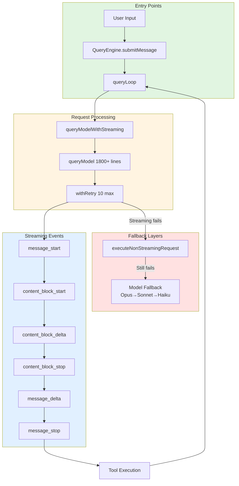
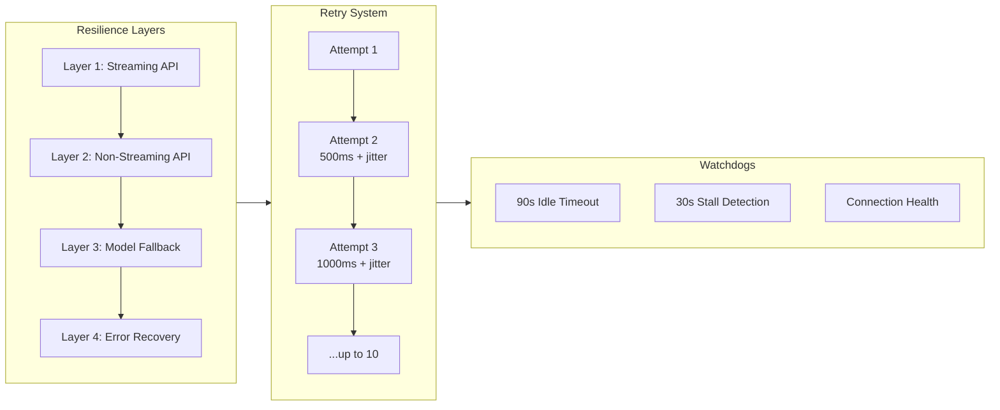
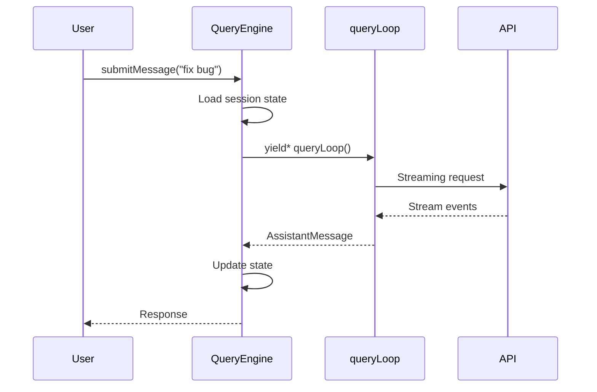
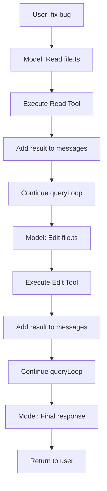
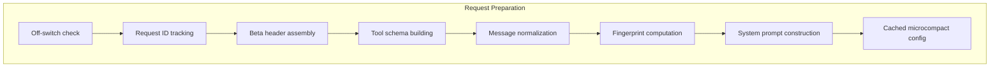
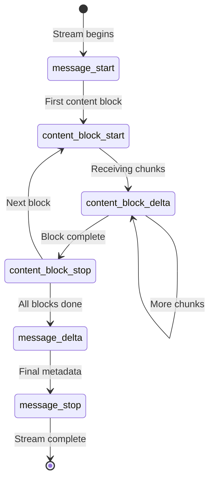
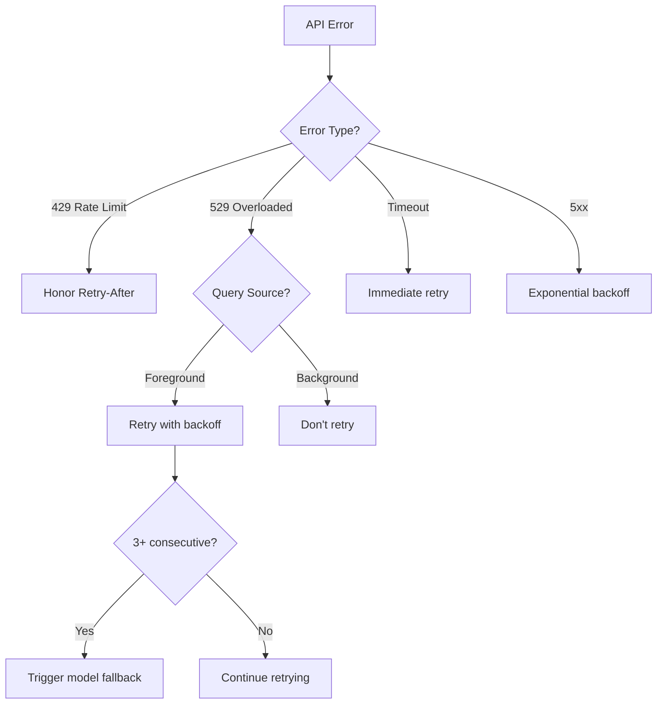
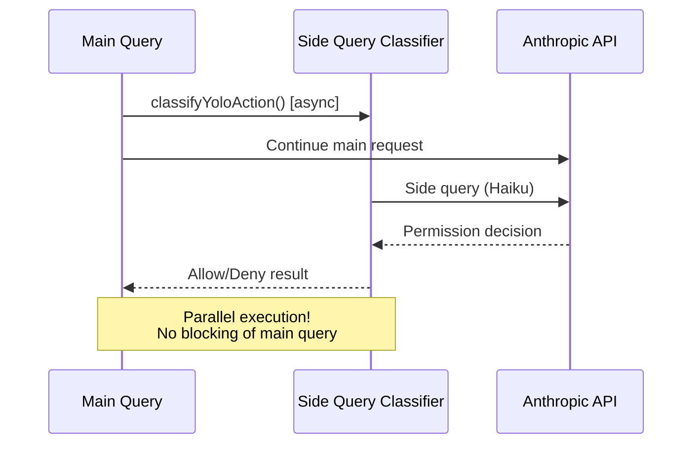
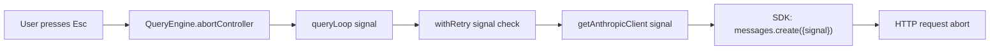

# Claude Code Query Flow and Message Streaming

## TL;DR

**What this document covers:** The complete internal architecture of how Claude Code processes AI requests—from the moment you press Enter to when the response appears on screen. This includes undocumented retry logic, hidden fallback mechanisms, and obscure streaming internals not covered in official docs.

**Key undocumented patterns:**
- **10-layer retry system** with exponential backoff + jitter (not just "it retries")
- **Streaming → Non-streaming → Model fallback** cascade (3 fallback layers)
- **Side queries** run in parallel to main conversation (used for permission classification)
- **529 error special handling** with different retry strategies per query source
- **90-second idle timeout** watchdog that aborts stalled streams
- **Request ID injection** for first-party API tracking (not in official docs)

**Why this matters:** Understanding these internals helps debug API issues, optimize for reliability, and understand why Claude Code behaves differently than raw API calls.



---

## Table of Contents

1. [Architecture Overview](#architecture-overview)
2. [Entry Points Deep Dive](#entry-points-deep-dive)
3. [The Query Loop](#the-query-loop)
4. [Streaming Implementation](#streaming-implementation)
5. [Retry Logic (withRetry.ts)](#retry-logic-withretryts)
6. [Side Queries](#side-queries)
7. [Client Configuration](#client-configuration)
8. [Error Handling](#error-handling)
9. [Abort/Cancellation](#abortcancellation)
10. [Undocumented Configuration](#undocumented-configuration)

---

## Architecture Overview

Claude Code's query architecture is designed for **maximum resilience**. Unlike a simple API wrapper, it implements multiple layers of fallback, retry, and error recovery. The system must handle:

- Network interruptions (retry with backoff)
- API overload (529 errors with special handling)
- Streaming failures (fallback to non-streaming)
- Model unavailability (fallback to alternative models)
- User cancellation (graceful abort with cleanup)
- Token limit exceeded (reactive compaction)



---

## Entry Points Deep Dive

### 1. Main Query Entry (`src/query.ts:219-239`)

The primary entry point is deceptively simple but sets up the entire tracking infrastructure:

```typescript
export async function* query(params: QueryParams): AsyncGenerator<...> {
  const consumedCommandUuids: string[] = []
  const terminal = yield* queryLoop(params, consumedCommandUuids)
  // Notify completed commands for telemetry
  return terminal
}
```

**Undocumented behavior:** The `consumedCommandUuids` array tracks which slash commands were executed during this query. This is used for:
- Telemetry aggregation (which commands are popular)
- Analytics correlation (command → outcome)
- Debugging (reproducing exact command sequences)

### 2. SDK Entry Point (`src/QueryEngine.ts:184-295`)

The `QueryEngine` class is the stateful coordinator that survives across multiple turns:

```typescript
export class QueryEngine {
  private abortController: AbortController
  private messageManager: MessageManager
  private transcriptRecorder: TranscriptRecorder
  private permissionDenialTracker: DenialTracker
  
  async *submitMessage(prompt: string, options?): AsyncGenerator<SDKMessage> {
    // 1. Persist state across turns
    // 2. Handle abort signals
    // 3. Record to transcript
    // 4. Track permission denials
  }
}
```

**Key insight:** The `QueryEngine` maintains **session state** that persists even if individual queries fail. This includes:
- Message history (for context window management)
- Permission grants/denials (for security policy)
- Tool call state (for multi-turn tool interactions)



---

## The Query Loop

The `queryLoop` function (`src/query.ts` and related files) is the heart of Claude Code's request processing. It implements a **recursive generator pattern** that can handle multi-turn conversations with tool execution.

### Loop Structure

```typescript
async function* queryLoop(params: QueryParams, consumedCommands: string[]): AsyncGenerator<...> {
  while (true) {
    // 1. Prepare request
    const request = buildRequest(params)
    
    // 2. Execute query (with all fallbacks)
    const response = yield* executeQueryWithFallbacks(request)
    
    // 3. Process response
    if (response.hasToolCalls) {
      // Execute tools and continue loop
      const toolResults = yield* executeTools(response.toolCalls)
      params.messages.push(...toolResults)
      continue // Recursive continuation
    }
    
    // 4. Return final response
    return response
  }
}
```

**Undocumented pattern:** The loop uses **generator delegation** (`yield*`) which allows:
- Streaming responses to flow through without buffering
- Cancellation signals to propagate correctly
- Nested generators for tool execution

### Tool Execution Integration

When the model requests tool execution, the loop doesn't just execute and return—it **modifies the conversation state** and continues:



This recursive pattern is why Claude Code can handle **arbitrarily complex multi-step tasks** without losing context.

---

## Streaming Implementation

### Dual Entry Points

Claude Code implements **two completely different code paths** for streaming vs non-streaming:

```typescript
// Streaming: Returns AsyncGenerator for real-time events
export async function* queryModelWithStreaming({...}): AsyncGenerator<StreamEvent | AssistantMessage | SystemAPIErrorMessage> {
  return yield* withStreamingVCR(messages, async function* () {
    yield* queryModel(messages, ..., stream: true)
  })
}

// Non-streaming: Returns Promise with complete response
export async function queryModelWithoutStreaming({...}): Promise<AssistantMessage> {
  for await (const message of withStreamingVCR(...)) {
    if (message.type === 'assistant') {
      assistantMessage = message
    }
  }
  return assistantMessage
}
```

**Why two paths?** Streaming provides better UX (real-time output) but is more fragile. The non-streaming path is the **fallback** when streaming fails.

### The queryModel Monster Function (`src/services/api/claude.ts:1017-2892`)

This 1800+ line function handles the entire request lifecycle:

#### Phase 1: Request Preparation (lines 1028-1760)



**Undocumented details:**

1. **Off-switch check** (line 1028): Checks `CUSTOM_OFF_SWITCH` env var for emergency capacity management
2. **Request ID tracking** (lines 1051-1055): Injects `x-client-request-id` header for first-party API correlation
3. **Beta header assembly** (lines 1071-1222): Dynamically assembles 10+ beta headers based on feature flags
4. **Fingerprint computation** (line 1325): Computes attribution fingerprint for analytics
5. **Cached microcompact** (lines 1189-1205): Configures cache-aware compaction (ant-only feature)

#### Phase 2: Streaming Execution (lines 1776-1846)

The actual API call is wrapped in `withRetry`:

```typescript
const generator = withRetry(
  () => getAnthropicClient({
    maxRetries: 0,  // <-- Manual retry, not SDK retry
    model: options.model,
    fetchOverride: options.fetchOverride,
    source: options.querySource,  // <-- Tracks query origin
  }),
  async (anthropic, attempt, context) => {
    const result = await anthropic.beta.messages
      .create({ ...params, stream: true }, { signal, headers })
      .withResponse()
    return result.data
  },
  { model, fallbackModel, thinkingConfig, signal, querySource }
)
```

**Key insight:** `maxRetries: 0` means the SDK won't retry—Claude Code implements its own retry logic in `withRetry` for more control.

#### Phase 3: Event Processing (lines 1931-2304)

The streaming loop is a **state machine** that processes SSE (Server-Sent Events):



**Event handling details:**

| Event | Lines | Purpose | Undocumented Behavior |
|-------|-------|---------|----------------------|
| `message_start` | 1980-1993 | Initial usage, TTFT | Captures `first_token_ms` for latency telemetry |
| `content_block_start` | 1995-2051 | Block initialization | Determines block type (text/thinking/tool_use) |
| `content_block_delta` | 2053-2169 | Chunk accumulation | Handles backpressure if client is slow |
| `content_block_stop` | 2171-2211 | Block completion | Yields complete block to generator |
| `message_delta` | 2213-2293 | Usage updates | Tracks token costs in real-time |
| `message_stop` | 2295-2297 | Cleanup | Triggers telemetry flush |

#### Watchdog System (lines 1874-1928)

Two undocumented watchdogs protect against stalled streams:

```typescript
// Idle timeout: Abort if no chunks for 90s
const idleTimeout = setTimeout(() => {
  abortController.abort(new Error('Stream idle timeout'))
}, STREAM_IDLE_TIMEOUT_MS) // 90000ms

// Stall detection: Log gaps >30s
const stallDetector = setInterval(() => {
  const gap = Date.now() - lastChunkTime
  if (gap > STALL_THRESHOLD_MS) { // 30000ms
    logEvent('tengu_stream_stall', { gapMs: gap })
  }
}, 5000)
```

**Why this matters:** The Anthropic API can occasionally stall. These watchdogs ensure Claude Code doesn't hang indefinitely.

---

## Retry Logic (withRetry.ts)

The retry system (`src/services/api/withRetry.ts`) is far more sophisticated than typical exponential backoff.

### Core Function (lines 170-517)

```typescript
export async function* withRetry<T>(
  getClient: () => Promise<Anthropic>,
  operation: (client, attempt, context) => Promise<T>,
  options: RetryOptions,
): AsyncGenerator<SystemAPIErrorMessage, T> {
  const maxRetries = getMaxRetries(options) // Default: 10
  let consecutive529Errors = options.initialConsecutive529Errors ?? 0
  
  for (let attempt = 1; attempt <= maxRetries; attempt++) {
    try {
      const client = await getClient()
      const result = await operation(client, attempt, context)
      return result
    } catch (error) {
      // Classify error and decide retry strategy
      const shouldRetry = classifyError(error, attempt, querySource)
      
      if (!shouldRetry) {
        throw error // Fatal, propagate up
      }
      
      // Calculate delay with jitter
      const delay = getRetryDelay(attempt, error.headers?.get('retry-after'))
      
      // Yield error message for UI display
      yield createErrorMessage(error)
      
      // Wait before retry
      await sleep(delay)
    }
  }
}
```

### Exponential Backoff + Jitter (lines 530-548)

```typescript
export function getRetryDelay(
  attempt: number,
  retryAfterHeader?: string | null,
  maxDelayMs = 32000,
): number {
  // Honor server's Retry-After if present
  if (retryAfterHeader) {
    const seconds = parseInt(retryAfterHeader, 10)
    if (!isNaN(seconds)) return seconds * 1000
  }
  
  // Exponential backoff: 500ms, 1000ms, 2000ms, 4000ms...
  const baseDelay = Math.min(BASE_DELAY_MS * Math.pow(2, attempt - 1), maxDelayMs)
  
  // Add jitter (0-25% random) to prevent thundering herd
  const jitter = Math.random() * 0.25 * baseDelay
  
  return baseDelay + jitter
}
```

**Delay progression:**

| Attempt | Base Delay | Max Jitter | Total Range |
|---------|-----------|------------|-------------|
| 1 | 500ms | 125ms | 500-625ms |
| 2 | 1000ms | 250ms | 1000-1250ms |
| 3 | 2000ms | 500ms | 2000-2500ms |
| 4 | 4000ms | 1000ms | 4000-5000ms |
| 5+ | 8000ms+ | 2000ms+ | Capped at 32s |

### 529 Error Special Handling (lines 62-89, 326-365)

**529 errors** ("Overloaded") get special treatment:

```typescript
const FOREGROUND_529_RETRY_SOURCES = new Set<QuerySource>([
  'repl_main_thread',  // Interactive user sessions
  'sdk',               // SDK usage
  'agent:*',           // Sub-agents
  'compact',           // Context compaction
  'auto_mode',         // Auto-mode classifier
  // ... 15 more sources
])

function shouldRetry529(querySource: QuerySource | undefined): boolean {
  // Background tasks (like telemetry) don't retry 529s
  return querySource === undefined || 
         FOREGROUND_529_RETRY_SOURCES.has(querySource)
}

// After 3 consecutive 529s, trigger model fallback
if (consecutive529Errors >= MAX_529_RETRIES && options.fallbackModel) {
  throw new FallbackTriggeredError(options.model, options.fallbackModel)
}
```

**Undocumented behavior:**
- Background tasks (telemetry, analytics) **don't retry 529s** to reduce load
- After 3 consecutive 529s, Claude Code **falls back to a different model** (e.g., Opus → Sonnet)
- This is why you might see Claude Code "downgrade" models during API overload



---

## Side Queries

Side queries (`src/utils/sideQuery.ts`) are one of Claude Code's most powerful undocumented features. They allow **parallel API calls** outside the main conversation flow.

### Purpose

Used for:
1. **Permission classification** (auto-mode/YOLO) - runs in parallel with main query
2. **Permission explainers** - generates human-readable explanations
3. **Session search** - searches conversation history
4. **Model validation** - checks if model is available
5. **Parallel permission checks** - multiple classifiers running simultaneously

### Implementation (lines 107-222)

```typescript
export async function sideQuery(opts: SideQueryOptions): Promise<BetaMessage> {
  // Uses separate Anthropic client with different settings
  const client = await getAnthropicClient({
    maxRetries: 2,  // Fewer retries than main query
    model,           // Can use different model (often Haiku for speed)
    source: 'side_query',  // Tagged for telemetry
  })
  
  // Build system prompt with attribution header
  const systemBlocks: TextBlockParam[] = [
    attributionHeader ? { type: 'text', text: attributionHeader } : null,
    ...(!skipSystemPromptPrefix ? [{ type: 'text', text: getCLISyspromptPrefix(...) }] : []),
    ...(Array.isArray(system) ? system : system ? [{ type: 'text', text: system }] : []),
  ].filter(Boolean)
  
  // Non-streaming request (faster for short queries)
  const response = await client.beta.messages.create({
    model: normalizedModel,
    system: systemBlocks,
    messages,
    ...(tools && { tools }),
    ...(output_format && { output_config: { format: output_format } }),
    ...(betas.length > 0 && { betas }),
    metadata: getAPIMetadata(),
  }, { signal })
  
  // Telemetry logging
  logEvent('tengu_api_success', { requestId, querySource: 'side_query', ... })
  return response
}
```

**Key differences from main query:**
- **Non-streaming** (faster for short responses)
- **Fewer retries** (2 vs 10)
- **Can use different model** (often Haiku for classification)
- **Separate telemetry tagging** (`side_query` source)
- **Shorter timeout** (not subject to 90s idle watchdog)

### Classifier Usage Pattern

The auto-mode classifier uses side queries for **parallel permission validation**:



This is why auto-mode feels fast—the permission check happens **in parallel**, not sequentially.

---

## Client Configuration

### Provider-Specific Clients (`src/services/api/client.ts:88-316`)

Claude Code supports multiple API backends with different client configurations:

```typescript
export async function getAnthropicClient({...}): Promise<Anthropic> {
  const defaultHeaders = {
    'x-app': 'cli',
    'User-Agent': getUserAgent(),
    'X-Claude-Code-Session-Id': getSessionId(),
    ...(containerId ? { 'x-claude-remote-container-id': containerId } : {}),
    ...(remoteSessionId ? { 'x-claude-remote-session-id': remoteSessionId } : {}),
  }
  
  // Provider-specific configuration
  if (isEnvTruthy(process.env.CLAUDE_CODE_USE_BEDROCK)) {
    return createBedrockClient(ARGS, model)
  }
  if (isEnvTruthy(process.env.CLAUDE_CODE_USE_FOUNDRY)) {
    return createFoundryClient(ARGS)
  }
  if (isEnvTruthy(process.env.CLAUDE_CODE_USE_VERTEX)) {
    return createVertexClient(ARGS, model)
  }
  
  // First-party API (default)
  return new Anthropic({
    apiKey: isClaudeAISubscriber() ? null : apiKey || getAnthropicApiKey(),
    authToken: isClaudeAISubscriber() ? getClaudeAIOAuthTokens()?.accessToken : undefined,
    ...ARGS,
  })
}
```

**Undocumented headers:**
- `x-app: cli` - Identifies client type
- `X-Claude-Code-Session-Id` - Session correlation for debugging
- `x-claude-remote-container-id` - Remote control container tracking
- `x-claude-remote-session-id` - Remote session tracking

### Request ID Tracking (lines 356-388)

First-party API requests get unique request IDs:

```typescript
export const CLIENT_REQUEST_ID_HEADER = 'x-client-request-id'

function buildFetch(fetchOverride, source): ClientOptions['fetch'] {
  const inner = fetchOverride ?? globalThis.fetch
  const injectClientRequestId = getAPIProvider() === 'firstParty' && isFirstPartyAnthropicBaseUrl()
  
  return (input, init) => {
    const headers = new Headers(init?.headers)
    if (injectClientRequestId && !headers.has(CLIENT_REQUEST_ID_HEADER)) {
      headers.set(CLIENT_REQUEST_ID_HEADER, randomUUID())
    }
    return inner(input, { ...init, headers })
  }
}
```

**Why this matters:** These UUIDs allow Anthropic to trace requests through their infrastructure for debugging and analytics. Third-party providers (Bedrock, Vertex) don't get these headers.

---

## Error Handling

### Error Classification System (`src/services/api/errors.ts:965-1161`)

Claude Code has a sophisticated error taxonomy:

```typescript
export function classifyAPIError(error: unknown): string {
  if (error instanceof APIConnectionTimeoutError) return 'api_timeout'
  if (error.message?.includes(REPEATED_529_ERROR_MESSAGE)) return 'repeated_529'
  if (error instanceof APIError && error.status === 429) return 'rate_limit'
  if (error instanceof APIError && error.status === 529) return 'server_overload'
  if (isPromptTooLongMessage(...)) return 'prompt_too_long'
  if (error instanceof APIError && error.status === 413) return 'content_too_large'
  if (error instanceof APIError && error.status >= 500) return 'server_error'
  // ... 20+ more classifications
}
```

**Error types not in official docs:**
- `repeated_529` - Multiple consecutive overload errors
- `prompt_too_long` - Context window exceeded (triggers compaction)
- `content_too_large` - Individual message too large
- `custom_off_switch` - Emergency capacity management

### User-Facing Error Messages (lines 425-934)

Errors are converted to assistant messages for display:

```typescript
export function getAssistantMessageFromError(error, model, options): AssistantMessage {
  // Timeout errors
  if (error instanceof APIConnectionTimeoutError) {
    return createAssistantAPIErrorMessage({ 
      content: API_TIMEOUT_ERROR_MESSAGE 
    })
  }
  
  // Rate limits with quota headers
  if (error instanceof APIError && error.status === 429) {
    const rateLimitType = error.headers?.get('anthropic-ratelimit-unified-representative-claim')
    const overageStatus = error.headers?.get('anthropic-ratelimit-unified-overage-status')
    
    if (overageStatus === 'enabled') {
      return createAssistantAPIErrorMessage({
        content: OVERAGE_ACTIVE_MESSAGE,
        error: 'rate_limit',
        errorDetails: error.message,
      })
    }
    
    return createAssistantAPIErrorMessage({
      content: RATE_LIMIT_MESSAGE,
      error: 'rate_limit',
      errorDetails: error.message,
    })
  }
  
  // Prompt too long → triggers reactive compaction
  if (error.message.toLowerCase().includes('prompt is too long')) {
    return createAssistantAPIErrorMessage({
      content: PROMPT_TOO_LONG_ERROR_MESSAGE,
      error: 'invalid_request',
      errorDetails: error.message,
    })
  }
}
```

**Special error messages:**

| Constant | Message | Trigger |
|----------|---------|---------|
| `PROMPT_TOO_LONG_ERROR_MESSAGE` | "Context limit exceeded..." | 413 error or prompt > limit |
| `REPEATED_529_ERROR_MESSAGE` | "Anthropic's API is overloaded..." | 3+ consecutive 529s |
| `CUSTOM_OFF_SWITCH_MESSAGE` | "Claude Code is temporarily unavailable..." | Capacity management |
| `API_TIMEOUT_ERROR_MESSAGE` | "Request timed out..." | 90s idle or connection timeout |

---

## Abort/Cancellation

### Signal Propagation Chain

The `AbortSignal` flows through the entire system:



### User Abort Detection (lines 2434-2461)

Distinguishes user cancellation from SDK timeout:

```typescript
if (streamingError instanceof APIUserAbortError) {
  if (signal.aborted) {
    // Real user abort (ESC key pressed)
    throw streamingError
  } else {
    // SDK timeout - convert to timeout error
    throw new APIConnectionTimeoutError({ message: 'Request timed out' })
  }
}
```

**Why this matters:** The UI shows different messages for "you cancelled" vs "request timed out".

### Resource Cleanup (lines 1519-1526, 2898-2912)

Ensures no memory leaks from aborted streams:

```typescript
function releaseStreamResources(): void {
  // Clear stream reference
  cleanupStream(stream)
  stream = undefined
  
  // Cancel HTTP response body
  if (streamResponse) {
    streamResponse.body?.cancel().catch(() => {
      // Ignore cancellation errors
    })
    streamResponse = undefined
  }
}
```

---

## Undocumented Configuration

### Environment Variables

| Variable | Default | Purpose |
|----------|---------|---------|
| `API_TIMEOUT_MS` | 600000 (10min) | Overall API timeout |
| `CLAUDE_CODE_MAX_RETRIES` | 10 | Max retry attempts |
| `CLAUDE_CODE_RETRY_BASE_DELAY` | 500 | Base retry delay (ms) |
| `CLAUDE_CODE_RETRY_MAX_DELAY` | 32000 | Max retry delay (ms) |
| `STREAM_IDLE_TIMEOUT_MS` | 90000 | Stream watchdog timeout |
| `STALL_THRESHOLD_MS` | 30000 | Stall detection threshold |
| `CUSTOM_OFF_SWITCH` | - | Emergency capacity off-switch |

### Query Source Tracking

The `querySource` parameter is used throughout for telemetry and retry decisions:

```typescript
type QuerySource = 
  | 'repl_main_thread'      // Interactive session
  | 'sdk'                   // SDK usage
  | 'agent:explore'         // Explore sub-agent
  | 'agent:plan'            // Plan sub-agent
  | 'agent:code'            // Code sub-agent
  | 'compact'               // Context compaction
  | 'auto_mode'             // Auto-mode classifier
  | 'side_query'            // Side query
  | 'background_task'       // Background agent
  // ... 20+ more sources
```

**Why this matters:** Different sources get different retry strategies. Background tasks don't retry 529s; interactive sessions do.

---

## Summary

Claude Code's query architecture is a masterclass in resilient API client design:

1. **10-layer retry system** with exponential backoff + jitter
2. **3-tier fallback**: Streaming → Non-streaming → Model fallback
3. **Parallel side queries** for permission classification
4. **529 special handling** with query-source-aware retry
5. **90-second watchdog** prevents indefinite stalls
6. **Comprehensive error taxonomy** with user-friendly messages
7. **Resource cleanup** prevents memory leaks
8. **Request ID tracking** for debugging

This architecture is why Claude Code feels reliable even when the underlying API has issues. It's not just wrapping the API—it's building a resilient system on top of it.

---

*based on alleged Claude Code source analysis (src/services/api/claude.ts, src/services/api/withRetry.ts, src/utils/sideQuery.ts)*
