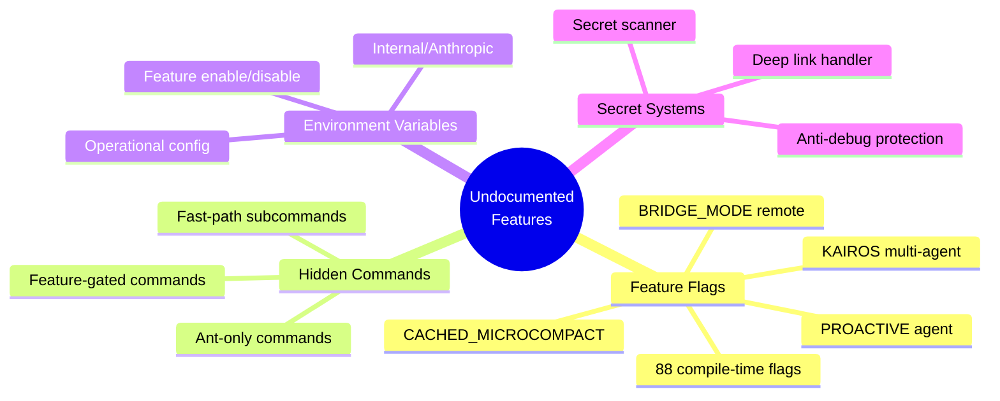
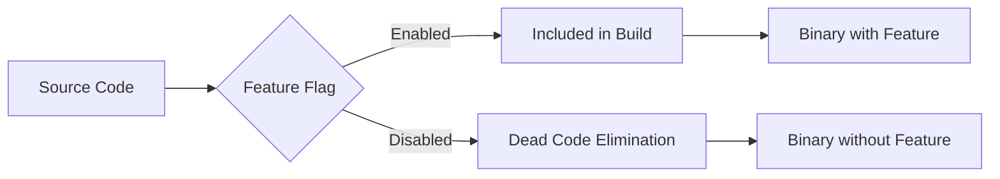
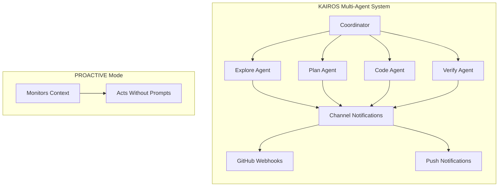
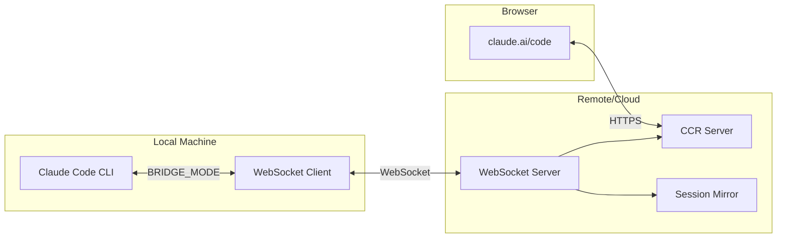
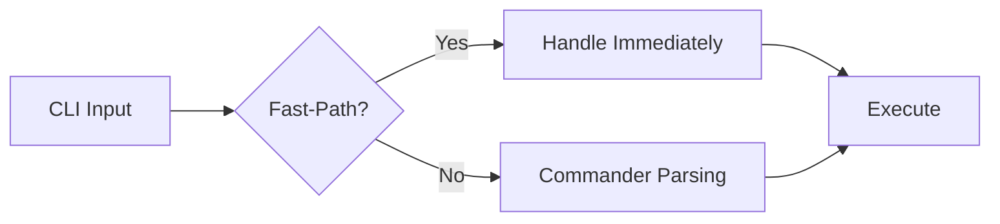
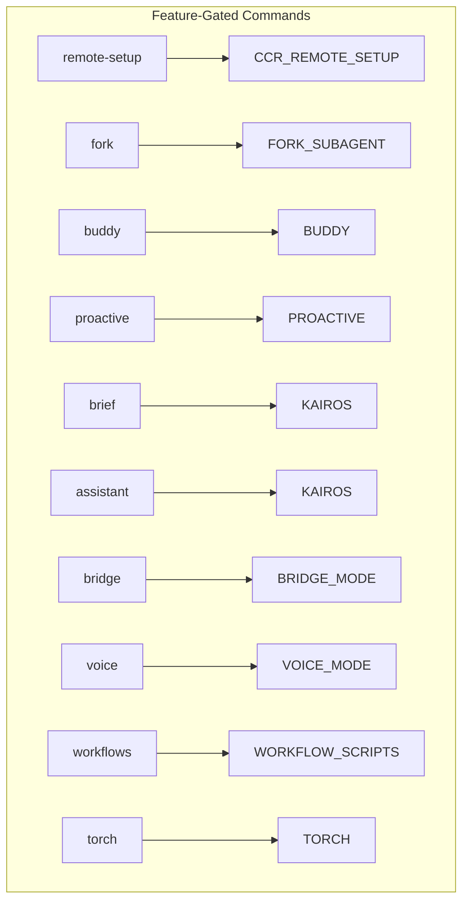

# Undocumented Features in Claude Code

## TL;DR

**What this document covers:** A comprehensive inventory of **88+ feature flags**, hidden CLI commands, undocumented environment variables, and obscure internal systems found in the Claude Code source code. These are not covered in the official documentation and many are gated behind Anthropic's internal build system.

**Key undocumented patterns:**
- **88 compile-time feature flags** via `feature()` from `bun:bundle` - most are dead-code eliminated in public builds
- **Fast-path subcommands** handled before Commander parsing (`remote-control`, `daemon`, `ps`, `attach`, `kill`, `ssh`)
- **Hidden CLI flags** (`--bare`, `--prefill`, `--agents`, `--fork-session`, `--effort`)
- **60+ environment variables** for feature enable/disable, operational config, and internal Anthropic use
- **24 ant-only commands** gated behind `USER_TYPE=ant`
- **Anti-debug protection** - process exits if debugger detected (non-ant builds)
- **Secret scanner** - 23+ detection rules for client-side secret scanning

**Why this matters:** Understanding these internals helps you:
- Discover hidden capabilities
- Debug feature availability issues
- Configure advanced options
- Understand the full scope of Claude Code's architecture



---

## Table of Contents

1. [Build-Time Feature Flags](#build-time-feature-flags)
2. [Hidden CLI Flags](#hidden-cli-flags)
3. [Fast-Path Subcommands](#fast-path-subcommands)
4. [Anthropic-Only Commands](#anthropic-only-commands)
5. [Feature-Gated Commands](#feature-gated-commands)
6. [Undocumented Environment Variables](#undocumented-environment-variables)
7. [Notable Hidden Systems](#notable-hidden-systems)

---

## Build-Time Feature Flags

Claude Code uses **compile-time feature flags** via `feature()` (imported from `bun:bundle`) for dead code elimination. There are **88 unique flags**. Most are undocumented and gated behind Anthropic's internal build configuration.

### How Feature Flags Work

```typescript
// From source: src/services/kairos/index.ts
if (feature('KAIROS')) {
  // This code is tree-shaken if KAIROS flag is false
  const kairosModule = require('./kairosModule')
  kairosModule.init()
}
```

**Key insight:** These are **build-time**, not runtime flags. Once the binary is built, features are either included or dead-code eliminated. You cannot enable them via environment variables in public builds.



### Agent Orchestration

| Flag | File References | Description | Status |
|---|---|---|---|
| `KAIROS` | Multiple | Full "assistant" agent mode with multi-agent capabilities | ant-only |
| `KAIROS_BRIEF` | commands/brief.tsx | KAIROS brief sub-feature | ant-only |
| `KAIROS_CHANNELS` | services/ | Channel-based notifications for KAIROS | ant-only |
| `KAIROS_DREAM` | services/ | KAIROS dream feature (purpose unclear) | ant-only |
| `KAIROS_GITHUB_WEBHOOKS` | commands/subscribe-pr.tsx | GitHub webhook subscriptions | ant-only |
| `KAIROS_PUSH_NOTIFICATION` | services/ | Push notification support | ant-only |
| `PROACTIVE` | components/, hooks/ | Agent acts without user prompts | ant-only |
| `COORDINATOR_MODE` | coordinator/ | Multi-agent orchestrator | ant-only |
| `AGENT_TRIGGERS` | services/ | Cron-based agent scheduling | ant-only |
| `AGENT_TRIGGERS_REMOTE` | tools/ | Remote trigger tool | ant-only |
| `AGENT_MEMORY_SNAPSHOT` | memdir/ | Persistent memory snapshots | ant-only |
| `VERIFICATION_AGENT` | tools/ | Separate verification agent | ant-only |
| `BUILTIN_EXPLORE_PLAN_AGENTS` | tools/ | Built-in explore/plan agent pair | ant-only |
| `FORK_SUBAGENT` | commands/fork.ts | Fork a sub-agent from current session | ant-only |
| `TRANSCRIPT_CLASSIFIER` | hooks/ | Auto permission mode from conversation analysis | ant-only |

**KAIROS Architecture:**



### Remote & Daemon

| Flag | Description | Status |
|---|---|---|
| `BRIDGE_MODE` | Remote control over WebSocket | ant-only |
| `DAEMON` | Long-running daemon supervisor | ant-only |
| `BG_SESSIONS` | Background session management (`ps`, `logs`, `attach`, `kill`) | ant-only |
| `DIRECT_CONNECT` | `cc://` and `cc+unix://` URL scheme support | ant-only |
| `LODESTONE` | Deep link URI handling | ant-only |
| `SSH_REMOTE` | `claude ssh <host>` sessions | ant-only |
| `CCR_REMOTE_SETUP` | CCR remote setup web command | ant-only |
| `CCR_AUTO_CONNECT` | CCR auto-connect | ant-only |
| `CCR_MIRROR` | CCR session mirroring | ant-only |
| `SELF_HOSTED_RUNNER` | CI self-hosted runner | ant-only |
| `BYOC_ENVIRONMENT_RUNNER` | Bring-your-own-cloud runner | ant-only |
| `UDS_INBOX` | Unix domain socket inbox/peers | ant-only |

**Remote Control Architecture:**



### Model & API

| Flag | Description | Status |
|---|---|---|
| `ANTI_DISTILLATION_CC` | Content filtering against distillation | ant-only |
| `CACHED_MICROCOMPACT` | Cached micro-compaction (cache-preserving) | ant-only |
| `PROMPT_CACHE_BREAK_DETECTION` | Detect prompt cache breaks | ant-only |
| `CONTEXT_COLLAPSE` | Context compaction | ant-only |
| `REACTIVE_COMPACT` | Reactive compaction | ant-only |
| `TOKEN_BUDGET` | API-side token budgets | ant-only |
| `UNATTENDED_RETRY` | Unattended retry logic | ant-only |
| `BASH_CLASSIFIER` | Bash command classification | ant-only |
| `CONNECTOR_TEXT` | Connector text summarization | ant-only |
| `EFFORT_BETA_HEADER` | Effort level beta | ant-only |

### Tools & Integrations

| Flag | Description | Status |
|---|---|---|
| `CHICAGO_MCP` | Computer-use MCP (screen/keyboard control) | ant-only |
| `MCP_SKILLS` | MCP server skill fetching | ant-only |
| `MCP_RICH_OUTPUT` | Rich MCP output rendering | ant-only |
| `EXPERIMENTAL_SKILL_SEARCH` | Skill search/discovery | ant-only |
| `SKILL_IMPROVEMENT` | Skill improvement surveys | ant-only |
| `RUN_SKILL_GENERATOR` | Skill generator | ant-only |
| `WORKFLOW_SCRIPTS` | Workflow tool/scripts | ant-only |
| `WEB_BROWSER_TOOL` | Web browser tool | ant-only |
| `TOOL_SEARCH` | Tool search capability | ant-only |
| `TREE_SITTER_BASH` | Tree-sitter bash parsing | ant-only |
| `POWERSHELL_AUTO_MODE` | PowerShell auto-mode detection | ant-only |

### UI & UX

| Flag | Description | Status |
|---|---|---|
| `BUDDY` | Buddy companion sprite with notifications | ant-only |
| `AUTO_THEME` | Auto theme detection | ant-only |
| `HISTORY_PICKER` | History picker dialog | ant-only |
| `HISTORY_SNIP` | Force-snip history command | ant-only |
| `MESSAGE_ACTIONS` | Message action menus | ant-only |
| `QUICK_SEARCH` | Quick search feature | ant-only |
| `TERMINAL_PANEL` | Terminal panel | ant-only |
| `STREAMLINED_OUTPUT` | Streamlined output mode | ant-only |
| `VOICE_MODE` | Voice interaction | ant-only |

### Telemetry & Internal

| Flag | Description | Status |
|---|---|---|
| `PERFETTO_TRACING` | Perfetto-compatible trace export | ant-only |
| `ENHANCED_TELEMETRY_BETA` | Enhanced telemetry | ant-only |
| `SHOT_STATS` | Shot statistics (ant-only) | ant-only |
| `SLOW_OPERATION_LOGGING` | Slow operation logging | ant-only |
| `ABLATION_BASELINE` | Harness-science experiments (disables thinking, compaction, memory, tasks) | ant-only |
| `ULTRAPLAN` | Extended planning mode | ant-only |
| `ULTRATHINK` | Extended thinking mode | ant-only |
| `TORCH` | Torch feature | ant-only |

---

## Hidden CLI Flags

Undocumented top-level flags from `src/main.tsx`:

### Core Flags

| Flag | Description | Example |
|---|---|---|
| `--bare` | Stripped-down hermetic auth mode | `claude --bare` |
| `--json-schema <schema>` | Enforce JSON output schema | `claude --json-schema '{...}'` |
| `--include-hook-events` | Emit hook events in output | `claude --include-hook-events` |
| `--input-format <format>` | Structured input parsing | `claude --input-format json` |
| `--replay-user-messages` | Replay mode | `claude --replay-user-messages` |
| `--prefill <text>` | Prefill the assistant response | `claude --prefill "I'll help..."` |
| `--agents <json>` | Pass agent definitions as JSON | `claude --agents '[...]'` |
| `--setting-sources <sources>` | Custom setting sources | `claude --setting-sources ...` |
| `--disable-slash-commands` | Disable all slash commands | `claude --disable-slash-commands` |

### Session Management

| Flag | Description | Example |
|---|---|---|
| `--fork-session` | Fork current session | `claude --continue --fork-session` |
| `--from-pr <pr>` | Start from a PR | `claude --from-pr 123` |
| `--agent <agent>` | Launch a specific agent | `claude --agent explore` |
| `--session-id <uuid>` | Force a specific session UUID | `claude --session-id ...` |
| `--name <name>` | Name the session | `claude --name "Bug Fix"` |

### Model & API

| Flag | Description | Example |
|---|---|---|
| `--betas <betas>` | Pass API beta flags | `claude --betas prompt-caching-2024-07-31` |
| `--effort <level>` | Set reasoning effort level | `claude --effort high` |
| `--fallback-model <model>` | Fallback model on primary failure | `claude --fallback-model sonnet` |
| `--file <specs>` | Pre-load file specs | `claude --file "src/*.ts"` |

### Integration

| Flag | Description | Example |
|---|---|---|
| `--strict-mcp-config` | Strict MCP config mode | `claude --strict-mcp-config` |
| `--plugin-dir <path>` | Plugin directory path | `claude --plugin-dir ./plugins` |
| `--chrome/--no-chrome` | Chrome integration toggle | `claude --chrome` |
| `--debug-file <path>` | Debug log to file | `claude --debug-file debug.log` |

---

## Fast-Path Subcommands

Handled **before Commander argument parsing** in `src/entrypoints/cli.tsx`:



### Remote & Session Management

| Subcommand | Aliases | Description | Example |
|---|---|---|---|
| `remote-control` | `rc`, `remote`, `sync` | Remote session control | `claude rc` |
| `daemon` | — | Long-running daemon mode | `claude daemon` |
| `ps` | — | List background sessions | `claude ps` |
| `logs` | — | View session logs | `claude logs <id>` |
| `attach` | — | Attach to running session | `claude attach <id>` |
| `kill` | — | Kill a session | `claude kill <id>` |
| `new` | — | New session | `claude new` |
| `list` | — | List sessions | `claude list` |
| `reply` | — | Reply to a session | `claude reply <id>` |

### CI/CD Runners

| Subcommand | Description | Example |
|---|---|---|
| `environment-runner` | CI environment runner | `claude environment-runner` |
| `self-hosted-runner` | CI self-hosted runner | `claude self-hosted-runner` |

### Connectivity

| Subcommand | Description | Example |
|---|---|---|
| `ssh` | SSH remote sessions | `claude ssh production` |
| `open` | Internal `cc://` deep link handler | `claude open cc://...` |

---

## Anthropic-Only Commands

Commands gated behind `USER_TYPE === 'ant'` (Anthropic employees):

### Functional Commands (7 work)

| Command | Status | Description |
|---|---|---|
| `commit` | ✅ Works | Creates git commit with generated message |
| `commit-push-pr` | ✅ Works | Commit, push, and create PR |
| `init-verifiers` | ✅ Works | Generate verification skills |
| `version` | ✅ Works | Print build version |
| `tag` | ✅ Works | Toggle searchable session tags |
| `files` | ✅ Works | List files in context |
| `bridge-kick` | ⚠️ Partial | Requires active bridge connection |

### Stubbed Commands (17 don't work)

Even with `USER_TYPE=ant`, these export `{ isEnabled: () => false }`:

```javascript
// All 17 stubs look like this:
export default { isEnabled: () => false, isHidden: true, name: 'stub' };
```

| Command | Inferred Purpose |
|---|---|
| `backfill-sessions` | Backfill session data for analytics |
| `break-cache` | Break/toggle prompt cache behavior |
| `bughunter` | Code review via bughunter system |
| `ctx_viz` | Context visualization |
| `good-claude` | Feedback/rating mechanism |
| `issue` | Create/interact with GitHub issues |
| `mock-limits` | Mock rate limit scenarios |
| `reset-limits` | Reset rate limits |
| `onboarding` | User onboarding flow |
| `share` | Share session data |
| `summary` | Summarize conversation |
| `teleport` | Remote session teleportation |
| `ant-trace` | Internal tracing/debugging |
| `perf-issue` | Report performance issues |
| `env` | Set session-scoped environment variables |
| `oauth-refresh` | Refresh OAuth tokens |
| `debug-tool-call` | Debug tool call execution |
| `agents-platform` | ⚠️ Missing module (would crash) |
| `autofix-pr` | Auto-fix PR review comments |

---

## Feature-Gated Commands

Commands available only when their corresponding feature flag is enabled:



| Command | Feature Flag | Description |
|---|---|---|
| `remote-setup` | `CCR_REMOTE_SETUP` | Remote setup wizard |
| `fork` | `FORK_SUBAGENT` | Fork sub-agent |
| `buddy` | `BUDDY` | Buddy companion |
| `proactive` | `PROACTIVE` or `KAIROS` | Proactive agent |
| `brief` | `KAIROS` or `KAIROS_BRIEF` | KAIROS brief |
| `assistant` | `KAIROS` | KAIROS assistant |
| `bridge` | `BRIDGE_MODE` | Bridge control |
| `remote-control-server` | `DAEMON` + `BRIDGE_MODE` | Remote control server |
| `voice` | `VOICE_MODE` | Voice interaction |
| `peers` | `UDS_INBOX` | Unix domain socket peers |
| `workflows` | `WORKFLOW_SCRIPTS` | Workflow management |
| `torch` | `TORCH` | Torch feature |
| `subscribe-pr` | `KAIROS_GITHUB_WEBHOOKS` | PR webhook subscriptions |
| `ultraplan` | `ULTRAPLAN` | Extended planning |
| `force-snip` | `HISTORY_SNIP` | Force history snip |

---

## Undocumented Environment Variables

### Feature Enable (22 variables)

| Variable | Description | Default |
|---|---|---|
| `CLAUDE_CODE_EXPERIMENTAL_AGENT_TEAMS` | Multi-agent swarm spawning | `false` |
| `CLAUDE_CODE_ENABLE_CFC` | Claude-in-Chrome integration | `false` |
| `CLAUDE_CODE_ENABLE_XAA` | Extended Authorization Architecture (MCP OAuth) | `false` |
| `ENABLE_AGENT_SWARMS` | Agent swarm support | `false` |
| `ENABLE_TOOL_SEARCH` | Tool search/discovery | `auto` |
| `ENABLE_SESSION_PERSISTENCE` | Session persistence | `false` |
| `ENABLE_BETA_TRACING_DETAILED` | Detailed beta tracing | `false` |
| `ENABLE_PROMPT_CACHING_1H_BEDROCK` | 1-hour prompt caching (Bedrock) | `false` |
| `ENABLE_ENHANCED_TELEMETRY_BETA` | Enhanced telemetry beta | `false` |
| `ENABLE_PID_BASED_VERSION_LOCKING` | PID-based version locking | `false` |
| `ENABLE_LOCKLESS_UPDATES` | Lockless update mechanism | `false` |
| `ENABLE_LSP_TOOL` | LSP tool | `false` |
| `ENABLE_CLAUDEAI_MCP_SERVERS` | claude.ai MCP servers | `false` |
| `ENABLE_MCP_LARGE_OUTPUT_FILES` | Large MCP output files | `false` |
| `ENABLE_CLAUDE_CODE_SM_COMPACT` | Session-memory compaction | `false` |

### Feature Disable (37 variables)

| Variable | Description | Default |
|---|---|---|
| `CLAUDE_CODE_DISABLE_EXPERIMENTAL_BETAS` | Kill switch for all experimental beta headers | `false` |
| `CLAUDE_CODE_DISABLE_FILE_CHECKPOINTING` | File checkpoint/rollback | `false` |
| `CLAUDE_CODE_DISABLE_AUTO_MEMORY` | Automatic memory extraction | `false` |
| `CLAUDE_CODE_DISABLE_MESSAGE_ACTIONS` | Message action menus | `false` |
| `CLAUDE_CODE_DISABLE_BACKGROUND_TASKS` | Background task execution | `false` |
| `CLAUDE_CODE_DISABLE_VIRTUAL_SCROLL` | Virtual scrolling | `false` |
| `CLAUDE_CODE_DISABLE_ADVISOR_TOOL` | Advisor tool | `false` |
| `CLAUDE_CODE_DISABLE_POLICY_SKILLS` | Policy-based skills | `false` |
| `CLAUDE_CODE_DISABLE_SM_COMPACT` | Session-memory compaction | `false` |
| `CLAUDE_CODE_DISABLE_TERMINAL_TITLE` | Terminal title setting | `false` |
| `CLAUDE_CODE_DISABLE_FEEDBACK_SURVEY` | Feedback surveys | `false` |
| `CLAUDE_CODE_DISABLE_LEGACY_MODEL_REMAP` | Legacy model remapping | `false` |
| `CLAUDE_CODE_DISABLE_NONESSENTIAL_TRAFFIC` | Non-essential network traffic | `false` |
| `CLAUDE_CODE_DISABLE_NONSTREAMING_FALLBACK` | Non-streaming fallback | `false` |
| `CLAUDE_CODE_DISABLE_GIT_INSTRUCTIONS` | Git instructions | `false` |
| `CLAUDE_CODE_DISABLE_OFFICIAL_MARKETPLACE_AUTOINSTALL` | Marketplace auto-install | `false` |
| `CLAUDE_CODE_DISABLE_CLAUDE_MDS` | Claude MDS | `false` |
| `CLAUDE_CODE_DISABLE_PRECOMPACT_SKIP` | Pre-compact skip | `false` |
| `DISABLE_PROMPT_CACHING` | All prompt caching | `false` |
| `DISABLE_PROMPT_CACHING_HAIKU` | Prompt caching for Haiku | `false` |
| `DISABLE_PROMPT_CACHING_SONNET` | Prompt caching for Sonnet | `false` |
| `DISABLE_PROMPT_CACHING_OPUS` | Prompt caching for Opus | `false` |
| `DISABLE_COMPACT` | Compaction entirely | `false` |
| `DISABLE_AUTO_COMPACT` | Auto-compaction | `false` |
| `DISABLE_INTERLEAVED_THINKING` | Interleaved thinking | `false` |
| `DISABLE_AUTOUPDATER` | Auto-updater | `false` |
| `DISABLE_LOGIN_COMMAND` | `/login` command | `false` |
| `DISABLE_LOGOUT_COMMAND` | `/logout` command | `false` |
| `DISABLE_FEEDBACK_COMMAND` | Feedback command | `false` |
| `DISABLE_DOCTOR_COMMAND` | `/doctor` command | `false` |
| `DISABLE_INSTALL_GITHUB_APP_COMMAND` | GitHub app install | `false` |
| `DISABLE_UPGRADE_COMMAND` | `/upgrade` command | `false` |
| `DISABLE_EXTRA_USAGE_COMMAND` | Extra-usage command | `false` |
| `DISABLE_COST_WARNINGS` | Cost warnings | `false` |
| `DISABLE_ERROR_REPORTING` | Error reporting | `false` |
| `DISABLE_TELEMETRY` | Telemetry | `false` |
| `DISABLE_INSTALLATION_CHECKS` | Installation checks | `false` |

### Internal / Anthropic (16 variables)

| Variable | Description | Access |
|---|---|---|
| `USER_TYPE` | Set to `'ant'` for internal Anthropic employees | ant-only |
| `CLAUDE_INTERNAL_FC_OVERRIDES` | GrowthBook feature flag overrides | ant-only |
| `CLAUDE_CODE_GB_BASE_URL` | GrowthBook base URL | ant-only |
| `USE_LOCAL_OAUTH` | Local OAuth config | ant-only |
| `USE_STAGING_OAUTH` | Staging OAuth config | ant-only |
| `CLAUDE_CODE_CUSTOM_OAUTH_URL` | Custom OAuth URL | ant-only |
| `CLAUDE_CODE_ABLATION_BASELINE` | Ablation baseline config | ant-only |
| `CLAUDE_ENABLE_STREAM_WATCHDOG` | Stream health watchdog | ant-only |
| `IS_DEMO` | Demo environment | ant-only |
| `CLAUDE_CODE_COWORKER_TYPE` | Coworker type for telemetry | ant-only |
| `CLAUDE_CODE_TAGS` | Session tags | ant-only |
| `MCP_CLIENT_SECRET` | MCP OAuth client secret | ant-only |
| `MCP_XAA_IDP_CLIENT_SECRET` | MCP XAA IdP client secret | ant-only |
| `CLAUDE_CODE_SIMPLE` | Bare/simple mode flag | ant-only |

### Operational (13 variables)

| Variable | Description | Example |
|---|---|---|
| `CLAUDE_CODE_REMOTE` | Running in CCR environment | `1` |
| `CLAUDE_CODE_ENTRYPOINT` | Entrypoint identifier | `cli`, `sdk-cli`, `mcp`, `local-agent` |
| `CLAUDE_CODE_ACTION` | Running as GitHub Action | `1` |
| `CLAUDE_CODE_SESSION_ACCESS_TOKEN` | Remote session access token | `token` |
| `CLAUDE_CODE_HOST_PLATFORM` | Host platform override | `linux`, `darwin`, `win32` |
| `CLAUDECODE` | Set to `'1'` for child processes | `1` |
| `ANTHROPIC_CUSTOM_HEADERS` | Custom HTTP headers | `Name: Value\nName2: Value2` |
| `ANTHROPIC_CUSTOM_MODEL_OPTION` | Pre-validated model name | `sonnet` |
| `ANTHROPIC_BETAS` | Comma-separated extra beta headers | `prompt-caching-2024-07-31,extended-output` |
| `CLAUDE_CODE_EXTRA_BODY` | Extra JSON body params | `'{"key": "value"}'` |
| `CLAUDE_CODE_EXTRA_METADATA` | Extra metadata | `'{"source": "ci"}'` |
| `API_TIMEOUT_MS` | API timeout in milliseconds | `600000` (10 min) |

---

## Notable Hidden Systems

### Anti-Debug Protection

**File:** `src/main.tsx:266-271`

In non-ant builds, the process exits if a debugger is detected:

```typescript
if (process.env.USER_TYPE !== 'ant' && isDebuggerDetected()) {
  console.error('Debugger detected. Exiting.')
  process.exit(1)
}
```

**Purpose:** Prevent reverse engineering of production builds.

### Secret Scanner

**File:** `src/services/teamMemorySync/secretScanner.ts`

Implements **client-side secret scanning** before team memory uploads, with 23+ detection rules:

```typescript
const SECRET_PATTERNS = [
  { name: 'AWS Access Key', pattern: /AKIA[0-9A-Z]{16}/ },
  { name: 'GitHub Token', pattern: /gh[pousr]_[A-Za-z0-9_]{36}/ },
  { name: 'Slack Token', pattern: /xox[baprs]-[0-9a-zA-Z-]+/ },
  { name: 'Private Key', pattern: /-----BEGIN (RSA |DSA |EC |OPENSSH )?PRIVATE KEY-----/ },
  // ... 20+ more patterns
]
```

**Why client-side?** Prevents secrets from ever reaching the server.

### Deep Link Handler

**Files:** `src/services/lodestone/`, `src/services/directConnect/`

`cc://` and `cc+unix://` URL scheme support via the `LODESTONE` and `DIRECT_CONNECT` feature flags:

```typescript
// Example deep link
cc://open?path=/home/user/project&session=abc-123

// Unix domain socket
cc+unix:///var/run/claude.sock
```

### Plugin System

**Directory:** `src/plugins/`

Full plugin infrastructure with:
- `/plugin` command - Manage plugins
- `/reload-plugins` command - Reload plugin code
- `--plugin-dir` flag - Custom plugin directory
- Plugin manifest schema (`plugin.json`)
- Hooks, MCP servers, LSP servers

### Vim Mode

**Directory:** `src/vim/`

Complete vim keybinding support:
- Text objects (words, paragraphs, quotes)
- Operators (delete, yank, change)
- Motions (h/j/k/l, w/b/e, 0/^/$, gg/G)
- Visual mode (character, line, block)
- Command mode (`:w`, `:q`, `:s/foo/bar/`)

### Memdir System

**Directory:** `src/memdir/`

Persistent memory directory for cross-session memory:
- `user/` - Private user preferences
- `feedback/` - Approach corrections
- `project/` - Team-shared project state
- `reference/` - External system pointers

### Buddy Companion

**Directory:** `src/buddy/`

A UI sprite/companion system with notifications:
- Animated sprite in terminal
- Notification badges
- Status indicators
- Easter egg interactions

### experimentalSystemReminder

**File:** `src/Tool.ts:275`

An experimental field on agent definitions that re-injects a system reminder every user turn:

```typescript
experimentalSystemReminder?: string  // Re-injected every turn
```

**Purpose:** Keep agent focused on specific behavior throughout long conversations.

---

## Summary

Claude Code contains **88+ feature flags**, **60+ environment variables**, and numerous hidden commands and systems. Most are:

1. **Build-time gated** - Dead-code eliminated if flag is false
2. **ant-only** - Only available to Anthropic employees
3. **Undocumented** - Not mentioned in official docs

The sheer scope of these features indicates Claude Code is a much larger platform than the public CLI suggests, with infrastructure for:
- Multi-agent orchestration (KAIROS)
- Remote/distributed execution (CCR, Bridge, SSH)
- CI/CD integration (Runners, GitHub Actions)
- Voice interaction (Voice Mode)
- Browser integration (Chrome, CFC)
- Advanced security (Secret Scanner, Anti-Debug)

---

*based on alleged Claude Code source analysis (src/main.tsx, src/entrypoints/cli.tsx, src/commands.ts, src/services/, src/utils/permissions/)*
